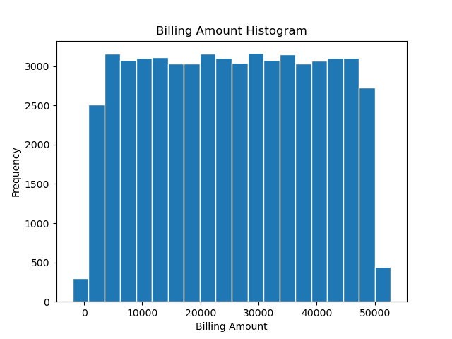

# Su Zhang Github Actions Matrix Project - IDS706 Week 4 Assignment
This project is built upon my pandas project that analyzes patient's healthcare records. The main purpose of this project is to test different python versions and environment in Github Actions.
 

# Source of data: 
https://www.kaggle.com/datasets/prasad22/healthcare-dataset/data

# Project Structure
* `githubactions`: Describes the steps and jobs that GitHub should run automatically. In this project, I added several python versions and environments, including 3.7, 3.8, 3.9, 3.11, for testing purposes.
* `Makefile`: Build automation commands: in this project, commands mainly include install, format, lint, and test.
* `requirements.txt`: Specify Python dependencies needed for this project, added packages of pandas and matplotlib. 
* `main.py`:  Main application script to read the input data and create functions to print out first few rows of dataset, summarize the key statistics, build histogram for specific data category
* `test_main.py`: Tests if the functions defined in main.py work normally
* `README.me`: Project documentation to offer an overview of the project
* `devcontainer`:  Set up a development environment in Github Codespace, and Dockerfile to define the base environment (such as what tools and libraries are installed)
* `healthcare_dataset.csv`: Input dataset on patients healthcare records
* `Billing_Amount_Hist.png`: Output histogram graph demonstrating the distribution of billing amount
* `Data_Summary.pdf`: Output pdf generated from Jupyter Notebook to showcase the analysis output

# Summary Statistics of Age and Billing Amount

# Histogram of Billing Amount Distribution

